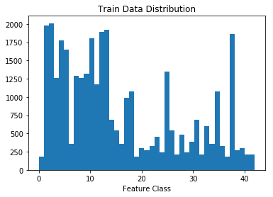
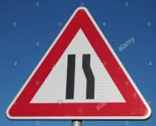

# **Traffic Sign Recognition** 

**Build a Traffic Sign Recognition Project**

The goals / steps of this project are the following:
* Load the data set (see below for links to the project data set)
* Explore, summarize and visualize the data set
* Design, train and test a model architecture
* Use the model to make predictions on new images
* Analyze the softmax probabilities of the new images
* Summarize the results with a written report

## Rubric Points
### Here I will consider the [rubric points](https://review.udacity.com/#!/rubrics/481/view) individually and describe how I addressed each point in my implementation.  

---
### Writeup / README

#### 1. Provide a Writeup / README that includes all the rubric points and how you addressed each one. You can submit your writeup as markdown or pdf. You can use this template as a guide for writing the report. The submission includes the project code.

You're reading it! and here is a link to my [project code](https://github.com/haritaparekh/CarND-Traffic-Sign-CLassifier-Project/blob/master/Traffic_Sign_Classifier.ipynb)

### Data Set Summary & Exploration

#### 1. Provide a basic summary of the data set. In the code, the analysis should be done using python, numpy and/or pandas methods rather than hardcoding results manually.
The analysis of the basic summary of data set was doing using numpy methods.The following are the output numbers:
* Number of training examples = 34799
* Number of validation examples = 4410
* Number of testing examples = 12630
* Image data shape = (32, 32, 3)
* Number of classes = 43

#### 2. Include an exploratory visualization of the dataset.

Here is an exploratory visualization of the data set. It is a bar chart showing data distribution for training, validation and test data. It visualizes the number of images available for each of the 43 classes.

Here is an exploratory visualization of the data set. It is a bar chart showing data distribution for training,validation and test data. It visualizes the number of images available for each of the 43 classes.

Below displaying image of each of the 43 class

### Design and Test a Model Architecture

#### 1. Describe how you preprocessed the image data. What techniques were chosen and why did you choose these techniques? Consider including images showing the output of each preprocessing technique. Pre-processing refers to techniques such as converting to grayscale, normalization, etc. (OPTIONAL: As described in the "Stand Out Suggestions" part of the rubric, if you generated additional data for training, describe why you decided to generate additional data, how you generated the data, and provide example images of the additional data. Then describe the characteristics of the augmented training set like number of images in the set, number of images for each class, etc.)
After observing the data distribution, the next step was to analyze the different training images.The images in the dataset needed preprocessing.The first stage of pipeline was to apply CLAHE(Contrast-limited adaptive histogram equalization).The images in the dataset where not uniformly illuminated.This would mean losing important data. Clahe fixes this issue.The image first needs to be converted to LAB space.The L channel is the lightness channel.CLAHE is applied to L channel and converted back to RGB space.The image is then converted to grayscale.Adding grayscale to the pipeline increased the accuracy of the model.The image was then normalized to achieve zero mean and equal variance.

#### 2. Describe what your final model architecture looks like including model type, layers, layer sizes, connectivity, etc.) Consider including a diagram and/or table describing the final model.

My final model is Basic LENET with dropout layers.Following are the details of each layer:

| Layer                 |    Description	                                      | 
|:---------------------:|:---------------------------------------------:              | 
| Input         	| 32x32x1 Grayscale image   	                              | 
| Convolution 5x5    	| 1x1 stride, VALID padding, outputs 28x28x6	              |
| RELU	                |                                                             |
| Dropout 	        | Keep Prob : 0.5 - Training Data 1.0 Test Data               |
| Max pooling	      	| k=2 2x2 stride, VALID padding  outputs 14x14x6              |
| Convolution 5x5	|  1x1 stride, VALID padding, outputs 10x10x16                |
| RELU	                |                                                             |
| Dropout 	        | Keep Prob : 0.5 - Training Data Keep Prob : 1.0 Test Data   |
| Max pooling	      	| k=2 2x2 stride, VALID padding  outputs 5x5x16               |
| Flatten               | Output 400                                                  |
| Fully connected	| output 120        					      |
| RELU                  |                                                             |
| Dropout 		| Keep Prob : 0.5 - Training Data Keep Prob : 1.0 Test Data   |
| Fully connected	| output 84        				              |
| RELU                  |                                                             |
| Dropout 		| Keep Prob : 0.5 - Training Data Keep Prob : 1.0 Test Data   |
| Fully connected	| output 43        					      |

 

#### 3. Describe how you trained your model. The discussion can include the type of optimizer, the batch size, number of epochs and any hyper-parameters such as learning rate.
The next step was to train the model.I first used EPOCH value 10,Batch size as 128 and Learning rate as 0.001.I played around with the value of learning rate and EPOCH to achieve better accuracy.I tried Learning rate value as 0.0001 and 0.1 but achieved best results for 0.001.Epoch value 10 was too low.I made it 100 and achieved good results (around 94-95%).Since the training time was too high,I started reducing the EPOCH value.EPOCH value 50 gave same results as EPOCH value 50. SO my final training values are as follows : 
EPOCHS = 50
BATCH SIZE = 128
LEARNING RATE = 0.001
 

#### 4. Describe the approach taken for finding a solution and getting the validation set accuracy to be at least 0.93. Include in the discussion the results on the training, validation and test sets and where in the code these were calculated. Your approach may have been an iterative process, in which case, outline the steps you took to get to the final solution and why you chose those steps. Perhaps your solution involved an already well known implementation or architecture. In this case, discuss why you think the architecture is suitable for the current problem.

My solution started with preprocessing the data. This is a very important step in training and getting a good accuracy. If the network is trained with a dataset rich in information, it becomes easier to train the network. The preprocessing step makes sure that the image is offering the maximum information available.The images are first converted to LAB format where L is the luminance channel.Training Dataset analysis showed some of the images were too dark to extract any meaningful information.Thus CLAHE - a form of adaptive Histogram Equalization is applied to the luminance channel to make the brightness of the picture uniform.The next step was to convert the image to grayscale.Converting to grayscale was done much later while trying to get the accuracy better.I was not sure about this step but I came to the conclusion after looking at the images that the color information was not useful(shape was the most useful) and hence converting to grayscale gave better accuracy.
The next step was to select a CNN network.I started with the one we used in the LAB - LENET.I made changes to output parameters (43 classes).I also added dropout for each layer to avoid overfitting.I used keep probability as 0.7 while training and 1.0 while testing.I started with keep probability as 0.5 but got better results with 0.7. AdamOptimizer was used.

My final model results were:
* training set accuracy of 99.9
* validation set accuracy of 96.9
* test set accuracy of 95.3

### Test a Model on New Images

#### 1. Choose five German traffic signs found on the web and provide them in the report. For each image, discuss what quality or qualities might be difficult to classify.

Here are five German traffic signs that I found on the web.I resized the images to 32x32.

 

 
 

The slippery road image was the most difficult one since the sign isn't as clear as the rest of the images.

#### 2. Discuss the model's predictions on these new traffic signs and compare the results to predicting on the test set. At a minimum, discuss what the predictions were, the accuracy on these new predictions, and compare the accuracy to the accuracy on the test set (OPTIONAL: Discuss the results in more detail as described in the "Stand Out Suggestions" part of the rubric).

Here are the results of the prediction:

| Image			        |     Prediction	        	| 
|:-----------------------------:|:-------------------------------------:| 
| Stop Sign      		| Stop sign   			        | 
| Slippery Road			| Slippery Road      			|		
| Road Narrows                  | Road Narrows                          |
| Road Work		        | Road Work			        |
| Children Crossing	        | Children Crossing		        |

The model was able to correctly guess 5 of the 5 traffic signs, which gives an accuracy of 100%. This compares favorably to the accuracy on the test set of 95.3 .

#### 3. Describe how certain the model is when predicting on each of the five new images by looking at the softmax probabilities for each prediction. Provide the top 5 softmax probabilities for each image along with the sign type of each probability. (OPTIONAL: as described in the "Stand Out Suggestions" part of the rubric, visualizations can also be provided such as bar charts)

The top five soft max probabilities for Stop Sign were

The top five soft max probabilities for Slippery Road Sign were

The top five soft max probabilities for Road Narrows Sign were

The top five soft max probabilities for Road Work Sign were

The top five soft max probabilities for Children Crossing Sign were

